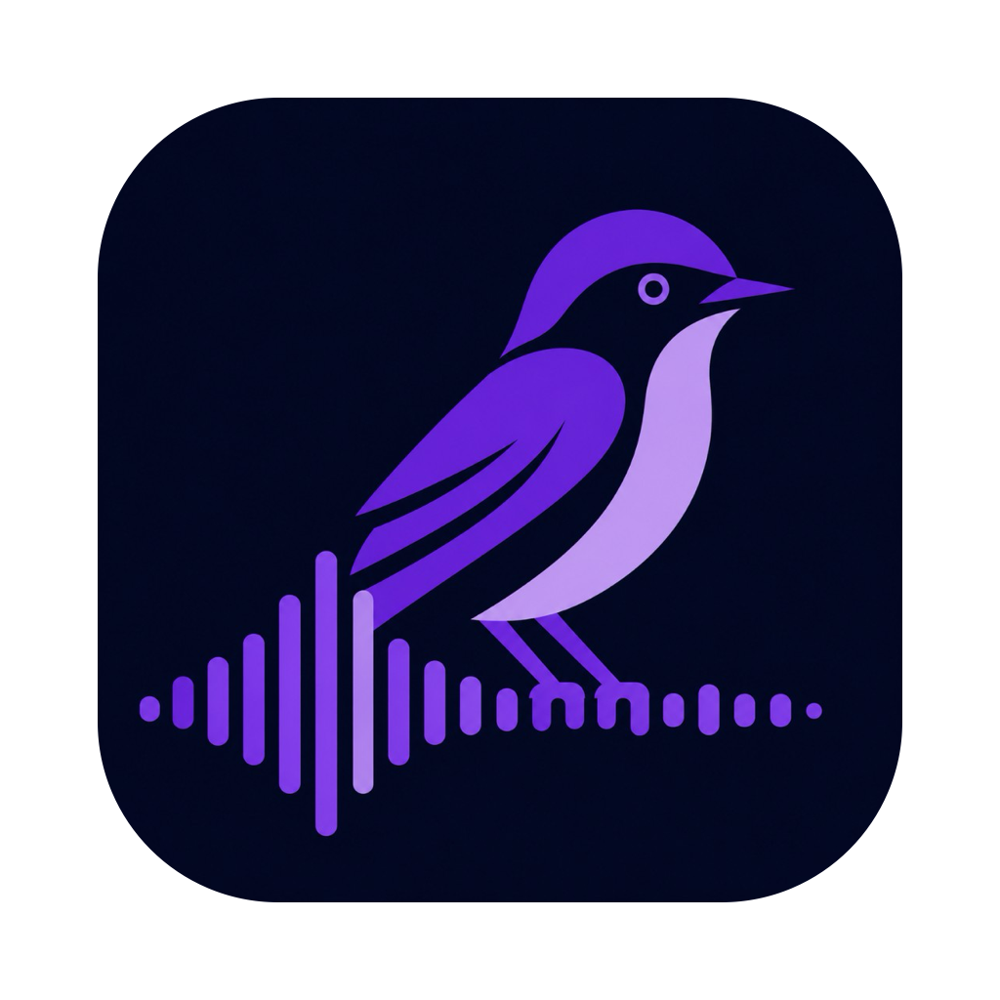
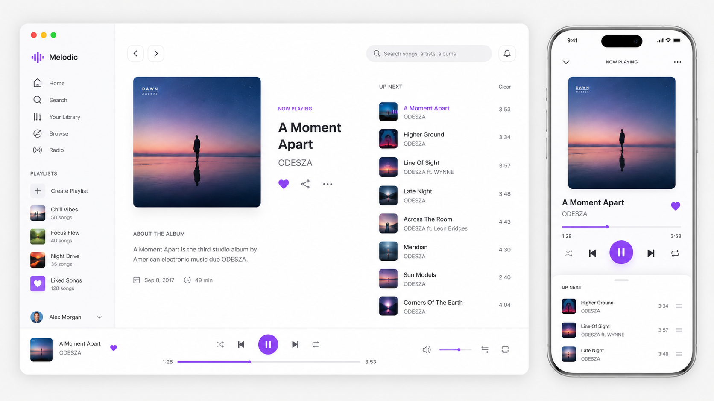
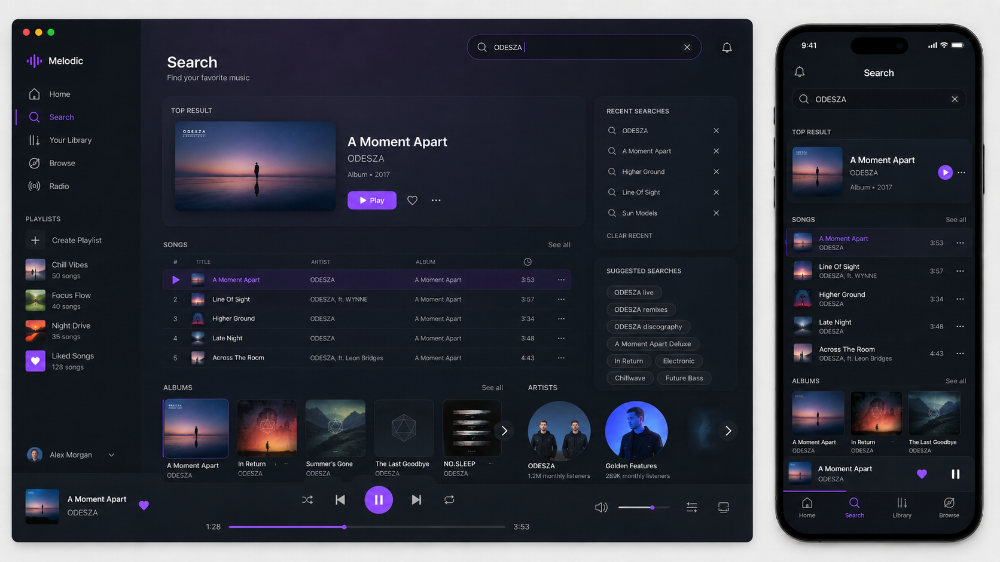
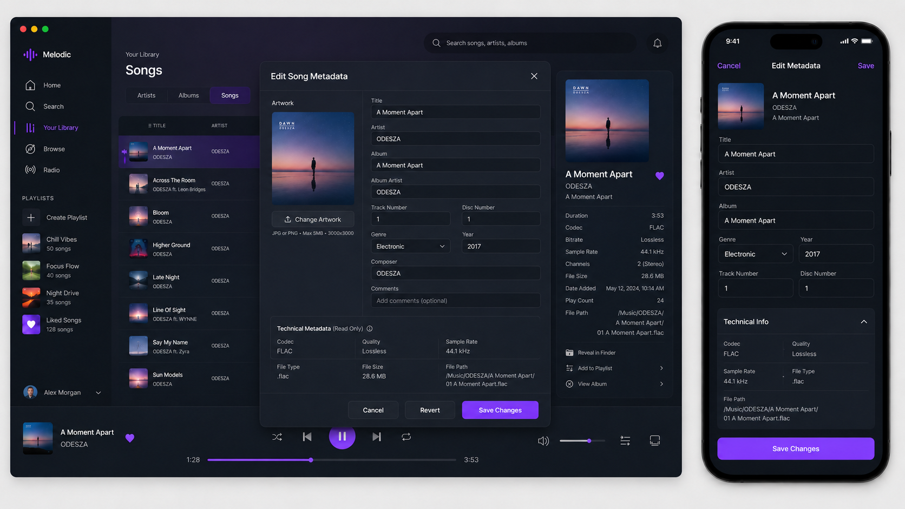
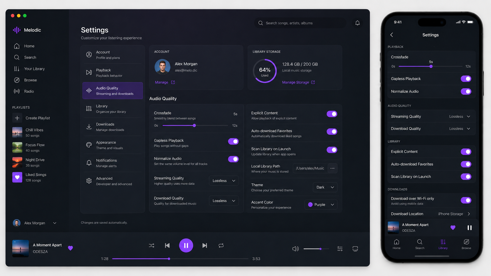
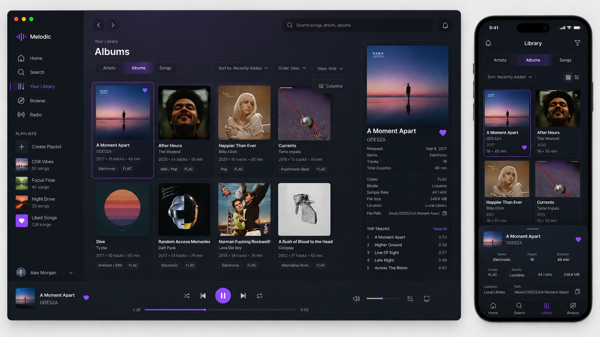
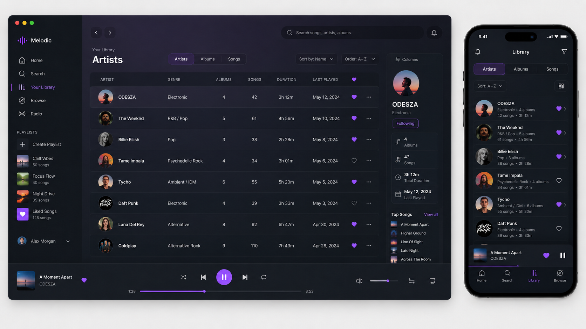
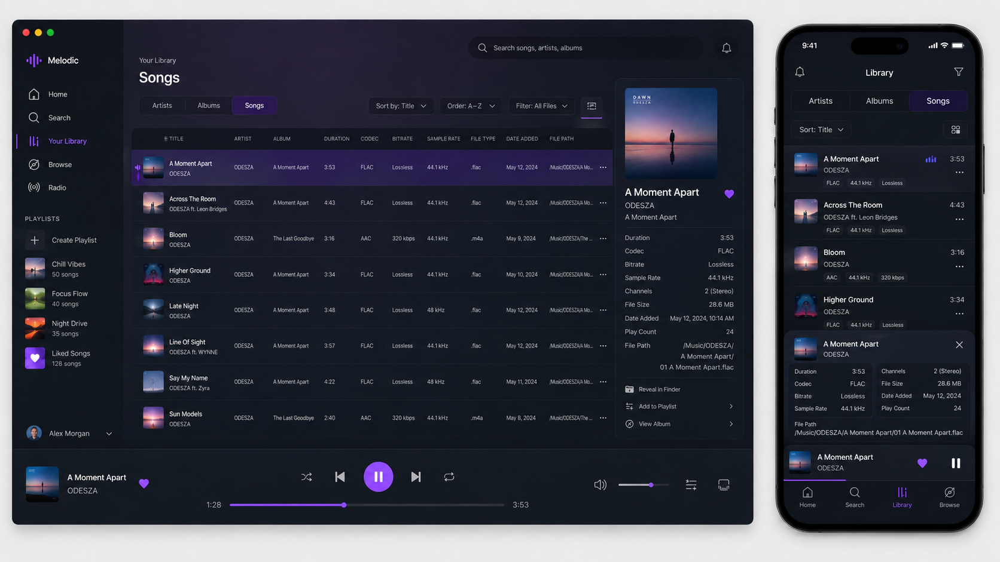

# Phoebe

<p align="center">
  
</p>

Phoebe is a Compose Multiplatform Plex-first music player for Android, iOS, desktop (JVM), and the browser (Kotlin/Wasm).

## What works now

### App shell and UI

- Compose Multiplatform entry points for Android, iOS, desktop, and Wasm JS.
- Album-art-inspired Material 3 UI: sign-in, server and library selection, library tabs (albums, artists, playlists, downloads), detail screens, downloads, and now-playing surfaces.
- Library table with configurable columns (title, artist, album, year, genre, path, codec, bitrate, duration, and related fields where data exists).
- Sorting and column visibility preferences persisted per platform.
- Demo catalog so the UI is explorable before connecting Plex.

### Plex integration

- PIN-based sign-in against Plex.tv, server discovery (including relay and shared connections), and music-library discovery.
- Fetching artists, albums, playlists, and tracks; lazy loading of track lists for large libraries with merge logic so opened detail views are not wiped on refresh.
- Stream URLs with tokenized asset URLs and optional original-file download (`download=1`).
- **Playlists:** resolve the server’s canonical machine id via `/identity` (important when relay ids differ from `clientIdentifier`), create playlists, and append tracks using Plex’s `server://…/library/metadata/…` URI format.
- **Metadata sync:** editing a track’s title or artist can push changes to the Plex server (`PUT` on the library section); the local catalog is always updated and persisted. Album and other fields are kept in the app catalog even when Plex does not accept them via this API path.

### Local media and merged catalog

- **Media sources:** multiple local folder roots with labels and enable/disable flags, stored in SQLDelight (with migration from older file-backed JSON where applicable).
- **Catalog merge:** Plex catalog (with stable `plex:` id prefix) merged with indexed local-folder catalogs from `LocalFolderMusicSourcePlugin`.
- **Platform indexing:** Desktop walks a chosen folder with common audio extensions and reads tags via JAudioTagger. Android uses Storage Access Framework (tree URI) and `MediaMetadataRetriever` for metadata. iOS has a native folder implementation. **Web:** local folder picker and indexing are currently stubbed (browser sandbox); Plex and the demo catalog work in the browser.

### Metadata editing

- Metadata editor (dialog / overlay) for title, artist, album, year, and genre, wired from the library and track surfaces.
- **Desktop and web:** secondary-click (right-click) opens the editor where enabled.
- Saves update the in-memory catalog and SQLDelight-backed persistence; when signed in to Plex and the change maps to a Plex track, the client attempts a server-side metadata update as described above.

### Web (Kotlin/Wasm)

- **Wasm JS target** with Webpack dev and production browser runs.
- **Persistence:** SQLDelight **Web Worker** driver with **sql.js** (`@cashapp/sqldelight-sqljs-worker`), a bundled worker script (`phoebe-sqljs.worker.js`), and copied `sql-wasm.js` / `sql-wasm.wasm` assets so the database does not block the main UI thread.
- **Storage:** schema initialization keyed in `localStorage` so the async schema can be created once per revision.
- **Playback:** HTML `<audio>` element implementing the shared `AudioPlayer` API; volume mapped to element volume.
- **HTTP:** Ktor client with the JS engine for Plex and downloads.

### Audio and platform services

- Shared `AudioPlayer` and `SystemVolumeController` abstractions with Android (Media3 / ExoPlayer), desktop (JavaFX-based player and macOS media-keys native bridge compiled from `MediaKeysBridge.m`), iOS, and web implementations.
- Global media-key and playback-shortcut hooks where implemented per platform.

### Data layer

- **SQLDelight** async database (`PhoebeDatabase`) for catalog, downloads state, session, media sources, library UI prefs, and play history — with **Android**, **SQLite (desktop)**, **Native (iOS)**, and **Web Worker (Wasm)** drivers.
- **Session** and **play history** repositories: play timestamps feed “last played” aggregates for artists, albums, and tracks in the library UI.

## Verify

```bash
./gradlew :composeApp:desktopTest
./gradlew :composeApp:assembleDebug
./gradlew :composeApp:compileKotlinIosSimulatorArm64
./gradlew :composeApp:wasmJsBrowserTest
```

## Run

**Desktop (default JVM “desktop” target):**

```bash
./gradlew :composeApp:run
```

**Web — development server (Webpack):**

```bash
./gradlew :composeApp:wasmJsBrowserDevelopmentRun
```

**Android debug APK:**

```bash
./gradlew :composeApp:assembleDebug
```

The Android SDK path is set in `local.properties` for this machine and ignored by git.

## Mockups

Design direction and UI explorations from the `mockups/` folder (may differ slightly from the current app build).

**Library — light**



**Search**



**Metadata**



**Settings**



**Album and artist**





**Now playing**


